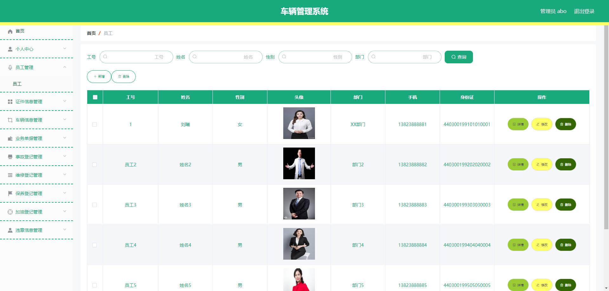
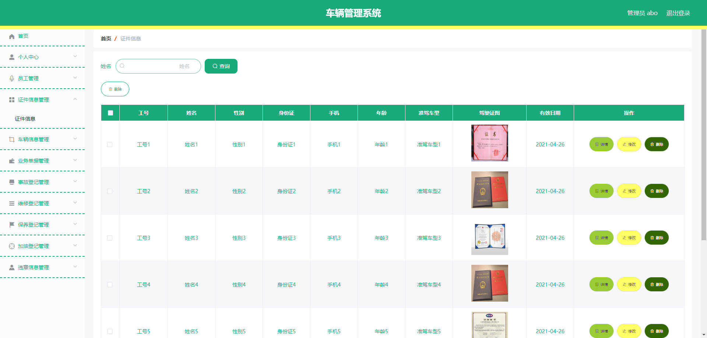
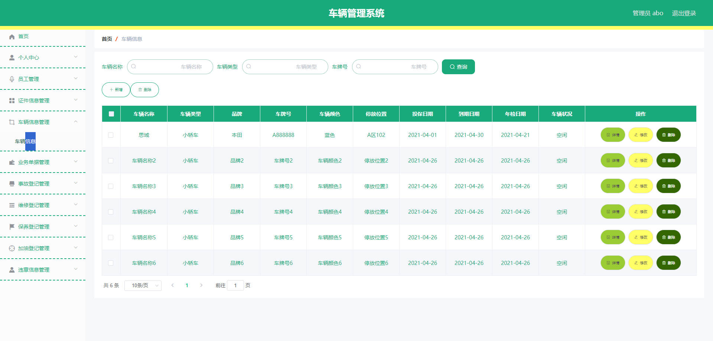
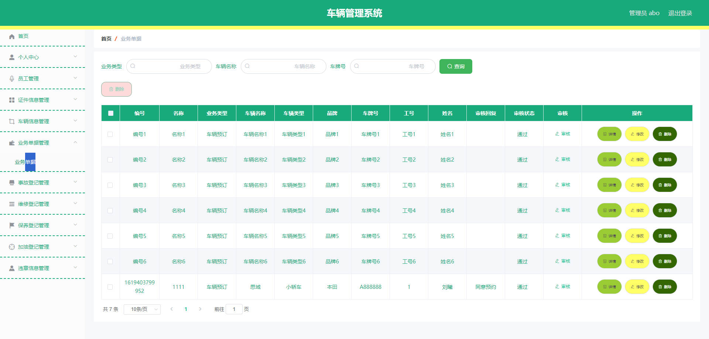
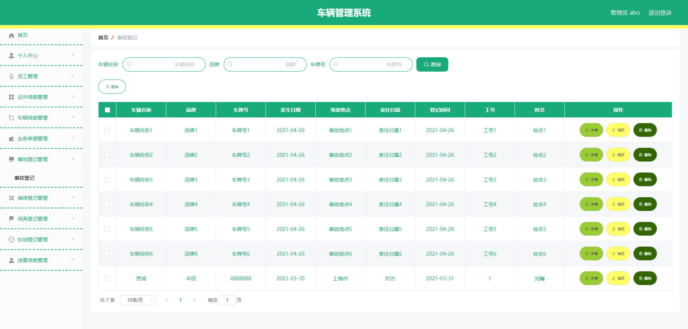
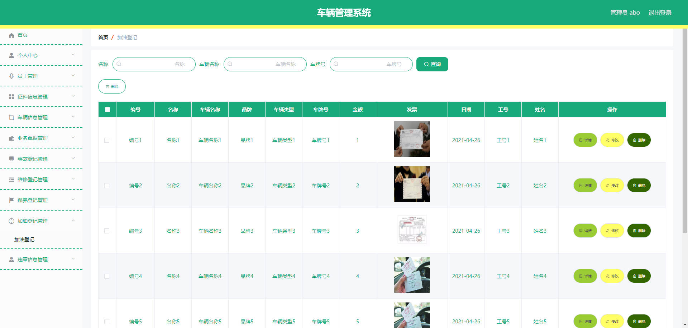
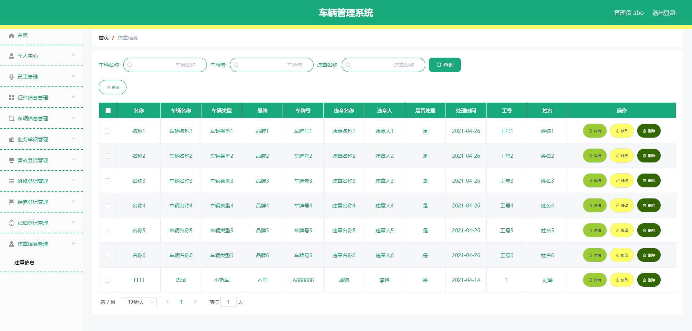
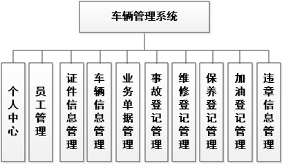
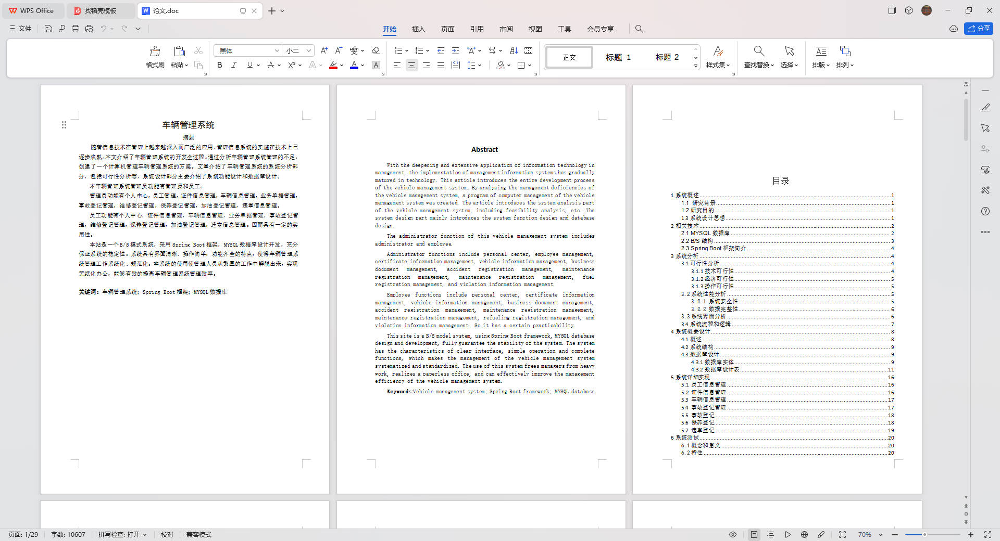

# 基于Springboot的车辆管理系统

## Springboot-0073


## 技术栈

Springboot mybatisplus vue mysql maven


## 数据库表(12张)


## 功能介绍

```properties
管理员功能有个人中心，员工管理，证件信息管理，车辆信息管理，业务单据管理，事故登记管理，维修登记管理，保养登记管理，加油登记管理，违章信息管理。


员工功能有个人中心，证件信息管理，车辆信息管理，业务单据管理，事故登记管理，维修登记管理，保养登记管理，加油登记管理，违章信息管理。
```


## 图片

### 前台

### 后台













## 访问路径

### 前台

```properties

```

### 后台

```properties
http://localhost:8080/springbootg2g8t/admin/dist/index.html#/login

账号 abo
密码 abo

账号 1
密码 1
```


## 功能图




## 文档目录




## 打赏或交流


